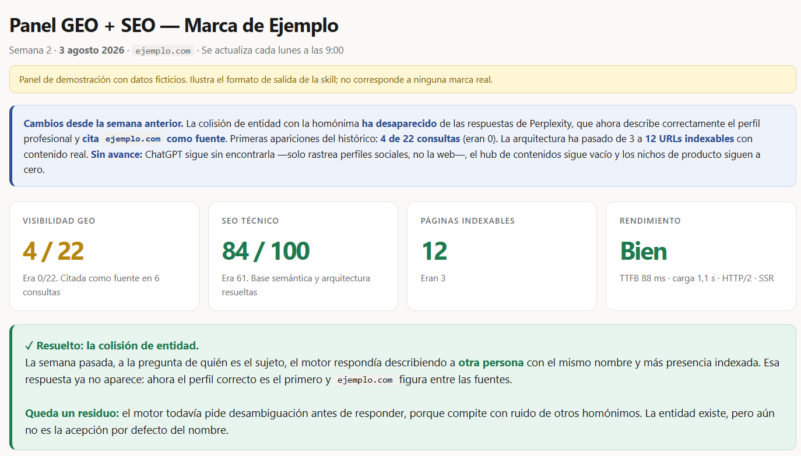
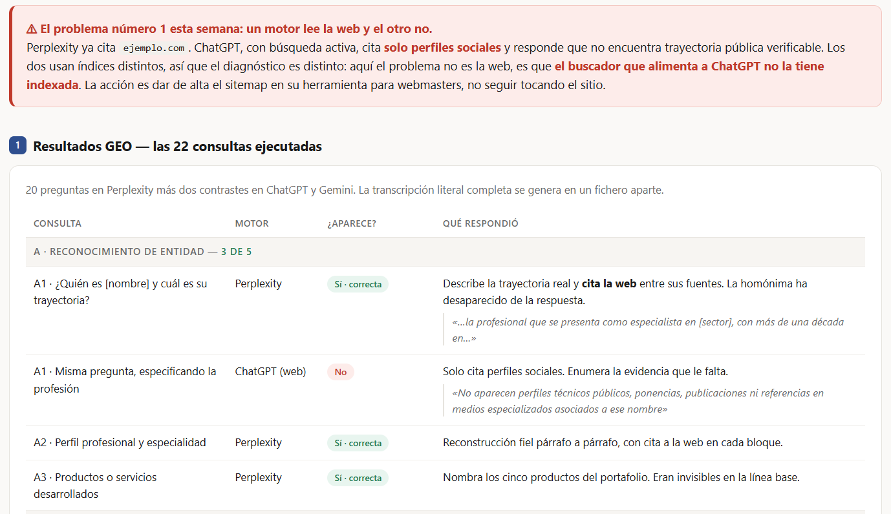
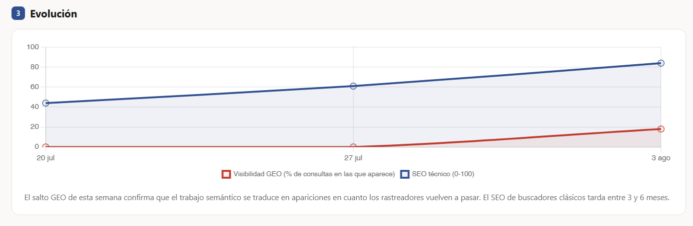
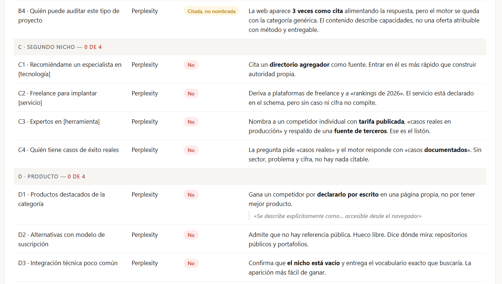
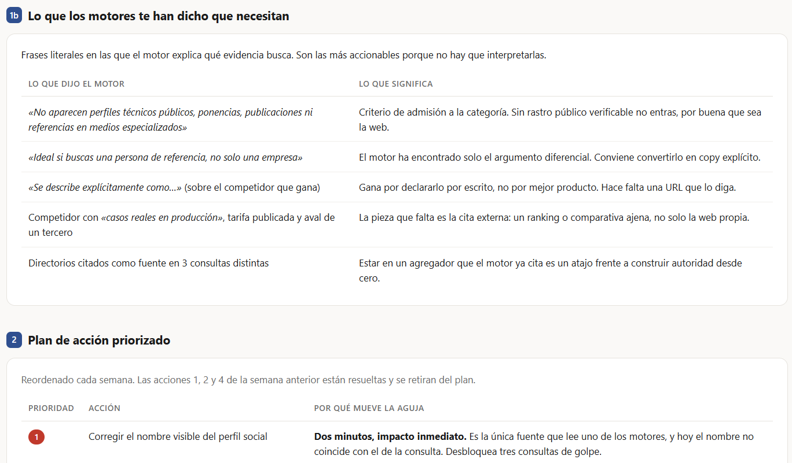
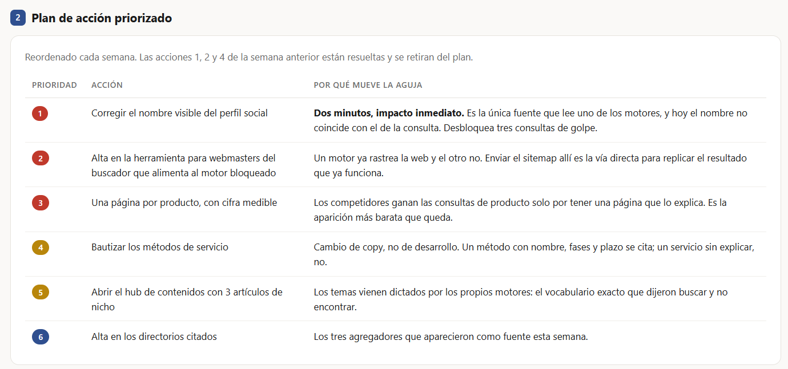

# analisis-geo-seo

**Mide si los motores generativos te recomiendan, y qué te falta para que lo hagan.**

Una skill para Claude que lanza una batería de consultas reales a Perplexity, ChatGPT y Gemini, audita tu web para que esos motores puedan citarte, y repite el análisis cada semana registrando la evolución en un panel con histórico.



> Todas las capturas son de un panel de demostración con datos ficticios. Puedes abrirlo tal cual: [`docs/demo-panel.html`](docs/demo-panel.html)

---

## Por qué

Un buscador clásico devuelve diez enlaces y tú decides. Un motor generativo devuelve **una respuesta con dos o tres nombres dentro**. O estás en esa respuesta, o para ese usuario no existes.

El problema es que no hay Search Console para esto. No sabes si apareces, no sabes quién aparece en tu lugar, y no sabes por qué. Esta skill convierte esa niebla en una serie de números que se pueden seguir semana a semana.

## Qué hace

**Línea base.** Entrevista breve sobre nichos y alias, auditoría técnica de la web, huella digital externa (LinkedIn, GitHub, menciones de terceros) y una batería de **15 consultas lanzadas íntegras en los tres motores** — 45 ejecuciones. Devuelve un panel HTML, la transcripción literal de todas las respuestas y un plan de acción priorizado.



**Seguimiento semanal.** Programa una ejecución recurrente, reutiliza la misma batería congelada —la comparabilidad es todo el valor del seguimiento— y encabeza el panel con «Cambios desde la semana anterior».



**Informe general acumulado.** Cruza qué acciones implementaste con qué se movió después, señala lo que lleva semanas bloqueado y reordena las prioridades.

## Las mismas preguntas en los tres motores

Perplexity, ChatGPT y Gemini usan índices distintos. Que uno te cite no implica nada sobre los demás, y la acción para arreglar cada uno es diferente: dar de alta el sitemap en Bing mueve ChatGPT y no toca a Perplexity.

Por eso la batería va **entera a los tres** y el panel nunca los promedia. Un 33 % agregado puede ser 100/0/0, y esos dos casos piden cosas opuestas. Tres tarjetas, tres series en el gráfico, tres diagnósticos.

## Tres estados, no dos

La diferencia que hace útil el análisis:

| Estado | Significado |
|---|---|
| **Recomendado** | El motor te nombra como respuesta. Se anota la posición frente a los competidores. |
| **Citado pero no nombrado** | Tu web está entre las fuentes y alimenta la respuesta, pero el motor se queda con la categoría genérica sin recomendar a nadie. |
| **Ausente** | Ni nombrado ni citado. |
| **No ejecutada** | No se pudo lanzar: sin sesión, cuota de búsqueda agotada, fallo de interfaz. **No cuenta como ausencia** y se resta del total de ese motor. |

Ese estado intermedio es el más informativo. Significa que la autoridad ya existe y lo que falta es que el contenido sea **atribuible**: un método con nombre, fases y entregable, en lugar de una descripción de capacidades. Con un simple sí/no se perdería justo la palanca que hay que mover.



## Qué tipo de hallazgos produce

Los más habituales, por orden de impacto:

**Colisión de entidad.** Otra persona u otra marca con tu mismo nombre, más indexada, ocupa la respuesta. Es el fallo más caro porque ninguna mejora técnica sirve mientras el motor crea que eres otro. Se detecta con las consultas del bloque de entidad y se ataca con `alternateName`, `sameAs` y una nota de desambiguación en el `llms.txt`.

**El plan lo dictan los propios motores.** En bastantes respuestas el motor explica qué evidencia busca y no encuentra: repositorios públicos, casos con cifras, ponencias, fichas en directorios concretos, menciones de terceros. La skill recoge esas frases literales en una sección aparte, porque no hay que interpretarlas — son una lista de tareas.



De ahí sale el plan de acción, ordenado por impacto frente a esfuerzo y no por orden lógico: una acción de dos minutos que desbloquea un motor entero va antes que un rediseño.



**Citado pero no recomendado.** Tu web aparece entre las fuentes y alimenta la respuesta, pero el motor se queda con la categoría genérica. Significa que la autoridad ya está y lo que falta es atribuibilidad: un método con nombre y plazo en lugar de una lista de capacidades.

**Recomendado con reservas.** El motor te nombra y a continuación añade «conviene validar referencias independientes» o «no he podido verificar X». Es la señal de que el cuello de botella ya no es tu web: es que solo hablas tú de ti. La skill registra esas coletillas aparte porque marcan el cambio de fase del trabajo.

**Un motor te ve y otro no.** El caso más común al principio, y el que más se malinterpreta si se mira una cifra agregada.

## Instalación

**Como skill de Claude** (Cowork o Claude Code): clona el repo en tu carpeta de skills.

```bash
git clone https://github.com/rociofperal/analisis-geo-seo.git ~/.claude/skills/analisis-geo-seo
```

O descarga el `.skill` de la sección [Releases](../../releases) y guárdalo desde la interfaz de Claude.

Después basta con pedirlo en lenguaje natural:

- «analiza el GEO y SEO de ejemplo.com»
- «mira si salgo en la IA»
- «dame el informe general»

## Estructura

```
├── SKILL.md                        # flujo principal: tres modos y seis fases
├── references/
│   ├── auditoria-tecnica.md        # qué medir y la rúbrica de puntuación /100
│   ├── cms.md                      # WordPress, Webflow, Shopify: dónde cambia todo
│   ├── bateria-consultas.md        # cómo construir las 15 consultas (5 bloques × 3)
│   ├── idiomas.md                  # qué cambia al analizar otros mercados
│   ├── motores.md                  # mecánica de navegador y sus trampas
│   ├── estado-json.md              # esquema del histórico
│   ├── panel.md                    # las nueve secciones del panel
│   └── informe-general.md          # informe acumulado
├── scripts/
│   ├── auditoria.js                # extracción del DOM en seis bloques
│   ├── puntuacion.py               # puntuación técnica sobre 100
│   └── informe_general.py          # series, movimientos y vida de cada acción
└── assets/
    └── plantilla-panel.html        # panel autocontenido (Chart.js por CDN)
```

El fichero que más rinde es `references/motores.md`: recoge las trampas de automatizar los tres motores —esperas, cómo leer las respuestas sin anclarse a rótulos que dependen del idioma, por qué el panel de fuentes de Perplexity no aparece en el texto extraído, cómo ChatGPT se come los acentos y por qué el botón de enviar de Gemini abre el selector de modelo— que solo se descubren ejecutando la batería de verdad unas cuantas veces.

## Requisitos

- Claude con acceso a un navegador (extensión Claude in Chrome o equivalente) para lanzar las consultas y auditar el DOM renderizado.
- ChatGPT y Gemini requieren **sesión iniciada** en el navegador: sin ella se pierden 30 de las 45 consultas. Perplexity no la necesita.
- Si la cuenta de ChatGPT es **gratuita**, su búsqueda web tiene tope diario y puede agotarse a mitad de la batería. La skill lo detecta y marca esas consultas como no ejecutadas en lugar de contarlas como ausencias.
- Python 3.8+ para los dos scripts de análisis.
- La batería completa lleva unos 50-60 minutos: Perplexity se automatiza por URL, pero ChatGPT y Gemini obligan a escribir y esperar.

## Alcance y limitaciones

Conviene decirlo claro:

- **La skill diagnostica, no publica.** No edita el proyecto web ni toca ninguna cuenta. Implementar los cambios es una decisión aparte, tuya.
- **La puntuación técnica es una estimación ponderada, no un Lighthouse.** Los pesos son un juicio razonado. Lo que importa es usar los mismos cada semana: si se cambian, hay que recalcular todo el histórico o la serie deja de significar nada.
- **Con una medición semanal y varias acciones en paralelo no se pueden aislar causas.** El informe general lo dice explícitamente y usa «coincidió con» en lugar de «causó» cuando la relación no es inequívoca. Un informe que se atribuye todo pierde credibilidad en la primera pregunta incómoda.
- **Los resultados de los motores varían entre ejecuciones.** Por eso la batería se congela y se compara la tendencia, no el dato aislado.

## Cómo se construyó

Con Claude, destilando ejecuciones completas y reales del análisis sobre sitios en producción. No es una idea teórica sobre cómo debería hacerse GEO: es lo que quedó después de lanzar la batería entera varias veces, equivocarse bastante por el camino y anotar qué funcionaba.

Buena parte de `references/motores.md` son cosas que no se pueden deducir leyendo documentación — solo aparecen cuando la automatización falla de verdad.

## Licencia

MIT. Ver [LICENSE](LICENSE).
